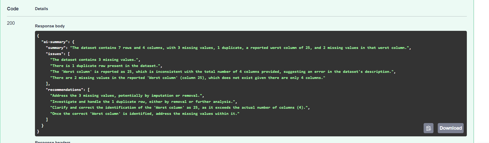

# Data Cleaning API

A FastAPI-based API that takes a messy CSV file, cleans it automatically,
saves the results, and returns an AI-generated summary of the data quality.

## Live Demo
🚀 [Try it live](https://data-cleaning-api-production-1ee1.up.railway.app/docs)

## Screenshot


## What It Does

Upload any CSV file and get back:
- Duplicate rows removed automatically
- Missing values filled intelligently
- Column names standardized
- Every upload saved to a database for history tracking
- AI summary with issues found and recommendations

## Real Example

Input: A CSV with 500 rows, 12 missing values, 8 duplicate records

Output:
```json
{
  "ai_summary": {
    "summary": "The dataset contains 492 rows and 8 columns after removing 8 duplicates, with 12 missing values identified.",
    "issues": [
      "Column 'email' contains the highest number of missing values (8)."
    ],
    "recommendations": [
      "Review missing email values before further analysis.",
      "Dataset is ready for further processing."
    ]
  }
}
```

## How To Run

1. Clone the repository
```bash
git clone https://github.com/moizautomation/ai-projects
```

2. Create virtual environment
```bash
python -m venv venv
venv\Scripts\activate
```

3. Install dependencies
```bash
pip install -r requirements.txt
```

4. Add your Gemini API key
```bash
GEMINI_API_KEY=your_key_here
```

5. Run the server
```bash
uvicorn main:app --reload
```

6. Open the docs
http://127.0.0.1:8000/docs

## API Endpoints

**POST /process-file**
- Upload a CSV file
- Cleans data, removes duplicates, fills missing values
- Saves record to SQLite database
- Returns AI summary with issues and recommendations

**GET /home**
- Health check endpoint

## Tech Stack

- Python
- FastAPI
- Pandas
- SQLite
- Google Gemini 2.5 Flash
- python-dotenv
- Railway (deployment)

## Built By

Abdul Moiz — Python AI Developer  
[LinkedIn](https://linkedin.com/in/abdulmoizai) · [Live Portfolio](https://ai-business-suite.streamlit.app)